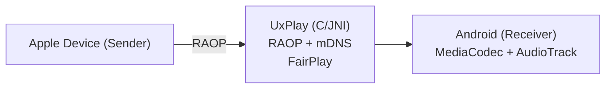

# AirPlay Receiver for Android

[](https://github.com/jqssun/android-airplay-server)
[](https://github.com/jqssun/android-airplay-server/releases)
[](https://github.com/jqssun/android-airplay-server/blob/main/LICENSE)
[](https://github.com/jqssun/android-airplay-server/actions/workflows/apk.yml)
[](https://github.com/jqssun/android-airplay-server/releases)

A fully featured free and open-source implementation of AirPlay for Android that turns your device into an AirPlay-compatible display and speaker, based on [UxPlay](https://github.com/FDH2/UxPlay).

[](https://play.google.com/store/apps/details?id=io.github.jqssun.airplay)
[](https://f-droid.org/packages/io.github.jqssun.airplay)
[](https://github.com/jqssun/android-airplay-server/releases/latest)

<video loop src='https://github.com/user-attachments/assets/79ed7c0c-0102-43cc-8816-4f00ce6a4199' alt="demo" width="200" style="display: block; margin: auto;"></video>

## Features

- Screen mirroring with H.264 and H.265 (HEVC) video decoding
- Audio streaming with AAC-ELD, AAC-LC and ALAC audio decoding
- Music streaming with track information, cover art, and playback controls
- Support for Picture-in-Picture, automatic resolution and mode switching
- Optional PIN authentication
- Video resolution, overscan, and frame rate control
- Audio latency control and support for software decoder fallback
- Debug overlay with real-time statistics (FPS, bitrate, codec, resolution, frame count, audio volume, etc.)
- Android native media session integration with notification controls

> [!WARNING]
> DRM content (e.g. from the Apple TV application) is not supported.

## Compatibility

- Android 8.0+
- Devices on the same subnet

## Implementation

This application uses the C-based [UxPlay](https://github.com/FDH2/UxPlay) library to implement the AirPlay/RAOP protocol, with a JNI bridge to the Android application layer. Audio is decoded via Android MediaCodec (AAC) or the Apple ALAC decoder (software fallback). Video is decoded via MediaCodec and rendered to a SurfaceView.



CMake is used for native C/C++ components under [`app/src/main/cpp`](app/src/main/cpp). Submodules must be initialized before building. 

```bash
git submodule update --init --recursive
./gradlew assembleDebug
```

Check out the [CI](https://github.com/jqssun/android-airplay-server/blob/main/.github/workflows/apk.yml) for more details on reproducible builds.

## Credits

- [UxPlay](https://github.com/FDH2/UxPlay) for the AirPlay/RAOP server implementation
- [ALAC](https://github.com/macosforge/alac) for the lossless audio decoder


---

Disclaimer: This project is not affiliated with Apple Inc.
